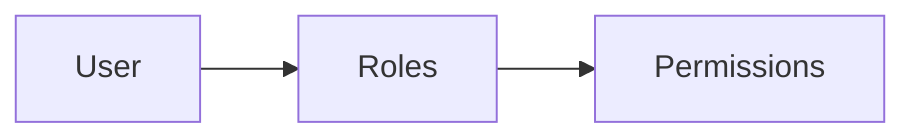

# Architecture

## Stack Choice

Workbench RBAC Builder uses React and TypeScript on the frontend because the product is stateful, form-heavy, and benefits from typed domain objects across users, roles, and permissions. Vite keeps local development fast and simple.

Express is used for the backend because the assignment calls for a REST API with clean service boundaries and no database. Its small surface area keeps the implementation focused on RBAC behavior rather than framework ceremony.

React Query owns server state: fetching users, roles, permissions, mutations, and cache invalidation after role or assignment changes. This avoids manual synchronization between screens.

Zustand owns local UI state: selected page, selected user, modal state, and toast messages. Those concerns are not persisted server state and do not need React Query.

React Hook Form and Zod are used together for role form validation. The frontend validates required role names, minimum length, uniqueness, and at least one permission. The backend also validates input so API calls remain safe.

## RBAC Model

The domain model has three core entities:

- Permission: a normalized string in the format `resource:action`, such as `projects:view` or `billing:download-invoices`.
- Role: a named collection of permission IDs.
- User: a person with zero or more assigned role IDs.

Relationships:



Users can hold multiple roles. Roles can overlap by containing the same permissions. Permissions are defined centrally and grouped by resource for rendering and validation.

## Permission Resolution

The application uses union-based permission resolution.

Effective permissions are calculated as all unique permissions across all roles assigned to a user.

Example:

- Role A: `projects:view`, `projects:create`
- Role B: `projects:view`, `projects:delete`
- Effective result: `projects:view`, `projects:create`, `projects:delete`

This strategy is used because the assignment only includes positive permissions. There are no explicit deny rules, priority rules, scoped grants, or conditional policies. Union resolution is predictable, easy to explain to administrators, and common in straightforward RBAC systems.

The backend implementation resolves permissions in `users.service.ts` by iterating over a user's assigned role IDs, collecting permissions in a `Set`, and returning the sorted unique list.

## Backend Structure

```text
backend/src
  data/
  middleware/
  modules/
    permissions/
    roles/
    users/
  routes/
  types/
  app.ts
  server.ts
```

Routes handle HTTP shape. Services handle domain behavior. Data files hold the in-memory seed records and permission definitions. Zod schemas validate incoming role and assignment payloads.

## Frontend Structure

```text
frontend/src
  components/
  features/
    permissions/
    roles/
    users/
  hooks/
  lib/
  services/
  store/
  types/
  App.tsx
```

Shared components provide the app shell pieces such as buttons, badges, cards, modals, tables, and toasts. Feature folders own product-specific behavior, including the role form, permission matrix, role cards, user table, assignment modal, and effective permissions panel.

## In-Memory Storage Tradeoffs

In-memory storage is appropriate for the assignment because it keeps setup light and demonstrates the core RBAC model without requiring database provisioning. It also makes seed data deterministic on every server restart.

Tradeoffs:

- Data resets whenever the backend restarts.
- No concurrent persistence guarantees.
- No audit trail for role or assignment changes.
- No pagination or search indexes.

A production database version would store users, roles, and permissions in relational tables. A join table would model user-role assignments, and another join table would model role-permission assignments. Effective permissions could be calculated at request time, cached per user, or materialized when role assignments change.

## Future Improvements

- Persist changes in PostgreSQL or another relational database.
- Add authentication and administrator authorization.
- Add audit logs for role changes and user assignment changes.
- Add role templates and environment-specific permission sets.
- Support scoped permissions, such as project-level grants.
- Add explicit deny rules only if the product needs more advanced policy behavior.
- Add API tests and frontend interaction tests for critical role flows.
